#Yemba Basic Sentence Orders
### $SVO$
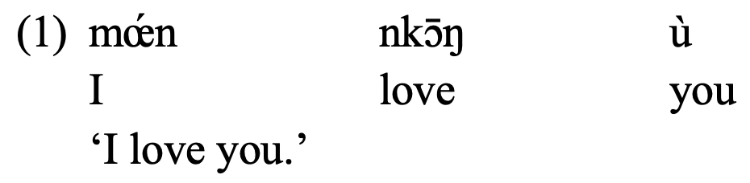
--

### $SVO_\text{direct}O_\text{indirect}$
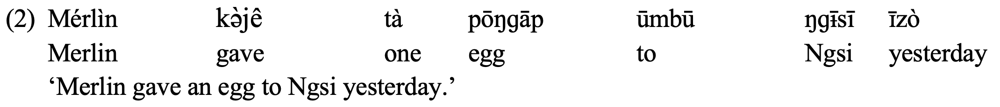
---
#Yemba Basic Sentence Order
### $SVO_\text{indirect}O_\text{direct}\quad$ **I**
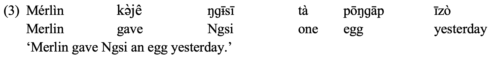
--

### $SVO_\text{indirect}O_\text{direct}\quad$ **II**
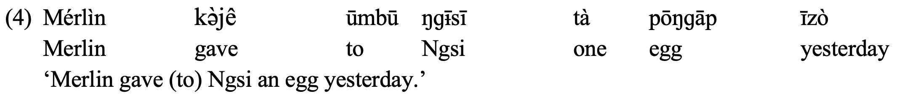
---
# Focus in Simple Sentences I
### for a $\quad SVO\quad$ sentence
It is **YOU** whom I love, (not someone else).
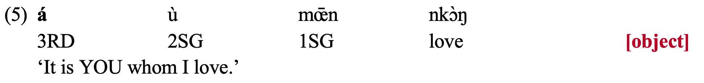
--

It is **I** who loves you, (not someone else).
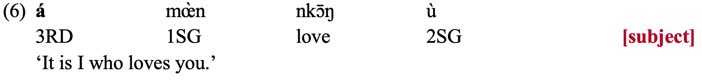

--

---
#Focus in Simple Sentences II
### for a $\quad SVO_\text{direct}O_\text{indirect}\quad$ sentence
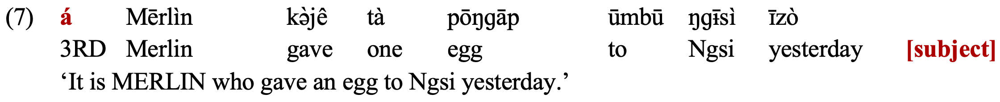
--

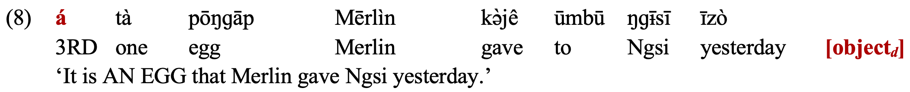
--

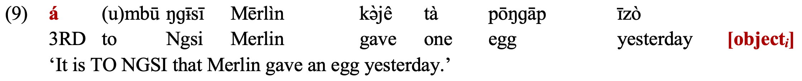
--

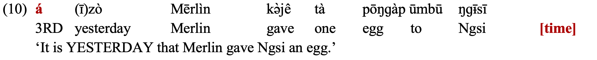

---
#Focus in Simple Sentences II
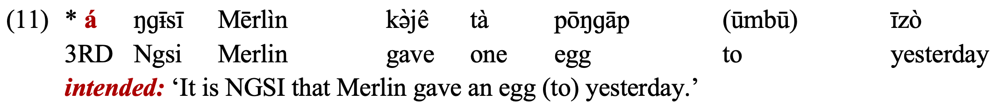
--

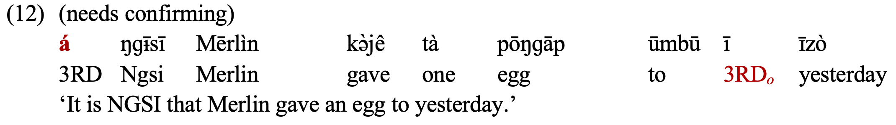

---
# Focus in Complex Sentence (Resumption)
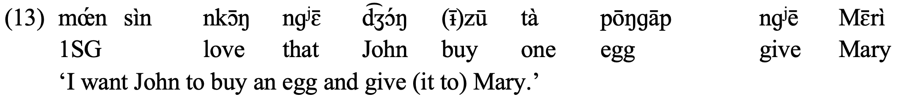
--

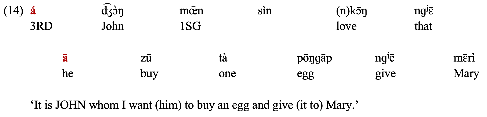
--

---
# Focus in Complex Sentence (Resumption)
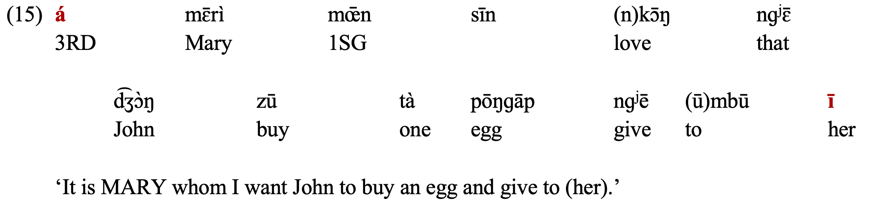
--

--

###I lost the data for focusing on "**ONE EGG**", that one is actually weird.

---
#Question I
### Whether it is focus or topic?

1. Michel: this is how we emphasise a certain part in a sentence;

2. Verb is not allowed in this structure;

3. Full sentences confirmation is needed: I love **YOU**, *NOT* someone else.

4. Whether they are allowed to be answers to certain questions

  A: 'Who gave an egg to Mary.'
  
  B: 'it is **JOHN** who gave an egg to Mary.'

---
#Question II
### Whether **á** is *it*-clefting or a *focus*-marker?
--

#Question III
### How do we analyse?
1. Base generated / Via movement?

2. Correspondence?

3. Do we analyse the simple and complex sentence in the same way usually? 

  [For this, I need to confirm with Michel whether simple sentences allow resumption.]
  
4. Agreement?
  [But '*yesterday*' is also allowed to be emphasised.]
---
class: center, middle

# Thank You!

## Slides created via the R package [**Xaringan**](https://github.com/yihui/xaringan).
