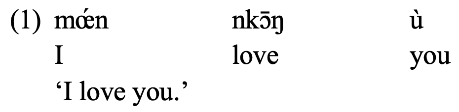
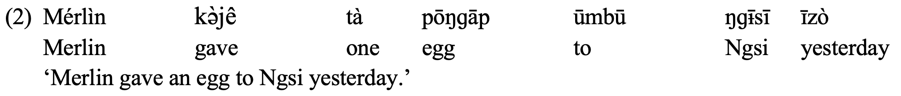
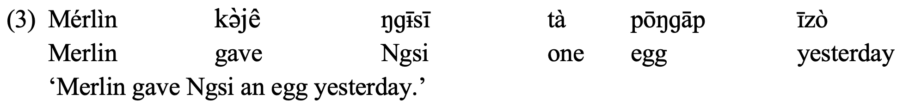
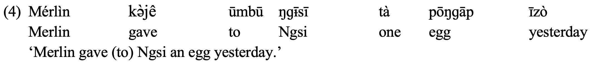

#Yemba Basic Sentence Order
### $SVO$

### $SVO_\text{direct}O_\text{indirect}$

---
#Yemba Basic Sentence Order
### $SVO_\text{indirect}O_\text{direct}\quad$ **I**

### $SVO_\text{indirect}O_\text{direct}\quad$ **II**

---
#Question I
### Whether it is focus or topic?

1. Michel: this is how we emphasise a certain part in a sentence;

2. Verb is not allowed in this structure;

3. Full sentences confirmation is needed: I love **YOU**, *NOT* someone else.

4. Whether they are allowed to be answers to certain questions

  A: 'Who gave an egg to Mary.'
  
  B: 'it is **JOHN** who gave an egg to Mary.'

---
#Question II
### Whether á is ***it***-clefting or a ***focus***-marker?

---
class: center, middle

# Thank You!

## Slides created via the R package [**Xaringan**](https://github.com/yihui/xaringan).
